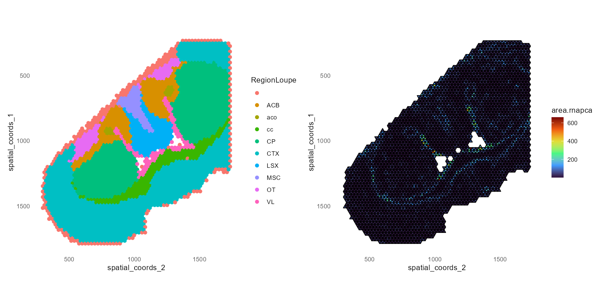
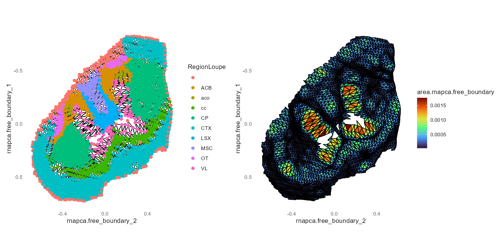
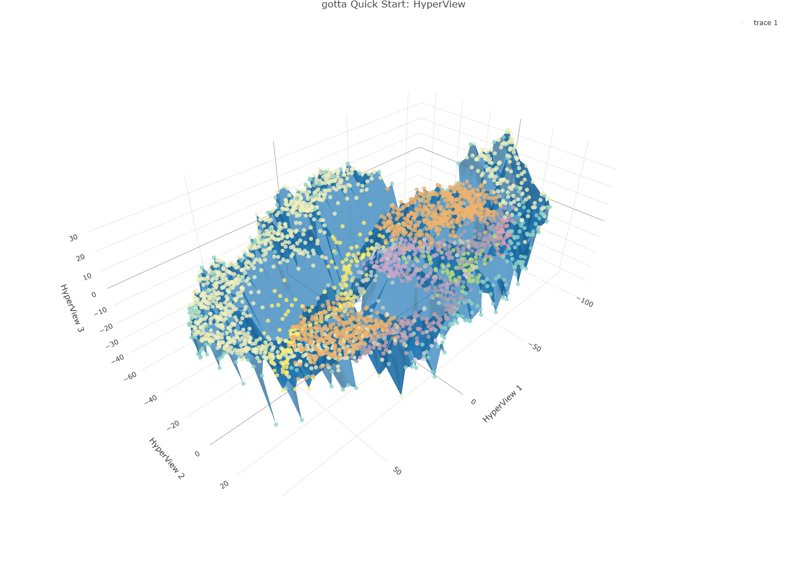

# gotta

**Geometric Optimal Transport Tableau & Alignment**

`gotta` is an R package for spatial transcriptomics analysis using geometric optimal transport methods. It provides tools for constructing spatial meshes, computing optimal transport cartograms, aligning assay layouts, estimating trajectories, and visualizing mesh-based spatial analyses.

## Features

- **GOTT (Geometric Optimal Transport Tableau)**: Transform spatial coordinates into cartogram layouts that preserve geometric properties while revealing structure in high-dimensional data
- **GOTTA (GOTT Alignment)**: Align different assay layouts (e.g., spatial to PCA) using optimal transport
- **Spatial Mesh Construction**: Build topological mesh representations of spatial transcriptomics data
- **Trajectory Analysis**: Estimate and visualize cellular trajectories in spatial context
- **HyperView Analysis**: Compute and visualize curvature and other geometric properties
- **Rich Visualization**: Multiple plotting functions for mesh-based and cartogram visualizations

## Installation

### Recommended for most users

Once `gotta` is published to `r-universe`, this will be the recommended installation route for most users because it is intended to provide a smoother experience than compiling directly from GitHub source:

```r
install.packages(
  "gotta",
  repos = c(
    "https://wujianhitsz.r-universe.dev",
    "https://cloud.r-project.org"
  )
)
```

Until the `r-universe` repository is live, or if you want the newest GitHub version immediately, install from GitHub source instead:

```r
install.packages("pak")
pak::pkg_install("WuJianHITSZ/gotta")
```

You can also use `remotes` if you prefer:

```r
install.packages("remotes")
remotes::install_github("WuJianHITSZ/gotta")
```

GitHub source installation is therefore the current fallback path and will remain useful for testing the newest development version.

### Developer installation

If you want the development version, plan to edit the package locally, or need to rebuild documentation and vignettes, clone the repository and install from the project directory:

```bash
git clone https://github.com/WuJianHITSZ/gotta.git
cd gotta
```

```r
install.packages(c("devtools", "pkgbuild"))
devtools::install(upgrade = "never")
```

If you also want to build vignettes during installation:

```r
devtools::install(build_vignettes = TRUE, upgrade = "never")
```

### Platform requirements

`gotta` contains C++ source code and requires compilation during source installation.

This means GitHub-based installation methods such as `pak::pkg_install()` and `remotes::install_github()` usually need a working local build toolchain.

Common requirements:

- R >= 4.1.0
- A compiler toolchain with C++17 support
- Build support for `Rcpp` and `RcppEigen`

Platform-specific notes:

- Windows: install a recent version of `Rtools` that matches your R version, then restart R before installing from source.
- macOS: install Apple Command Line Tools with `xcode-select --install`. On Apple Silicon, make sure you are using a current R build and toolchain.
- Linux: install `g++`, `make`, and standard development libraries from your distribution. On Debian/Ubuntu this usually means `build-essential`.

If compilation fails, check first that your R version, compiler toolchain, and `Rcpp`/`RcppEigen` are all available in the same R library.

## Quick Start

`gotta` ships with a lightweight toy Seurat object for reproducing the core workflow in `vignettes/quick_start.Rmd`.

```r
library(gotta)
library(Matrix) # fill holes
library(patchwork)

toy_path <- system.file(
  "extdata",
  "example-object-sma-mouse-heart-3-toy.rds",
  package = "gotta"
)
object <- readRDS(toy_path)
```

If you are working from a cloned source tree instead of an installed package, the same toy object is stored at `inst/extdata/example-object-sma-mouse-heart-3-toy.rds`.

```r
vertex.job <- VertexJob(reduction = "rnapca", n.components = 10)
gott.job <- GOTTJob(vertex.job = vertex.job, shape = "free_boundary")

object <- FindSpatialNeighbors(object, col.names = c("original_y", "original_x"))
object <- ComputeCellArea(object, vertex.job = vertex.job)

print(
  MeshFeaturePlot(object, layout.name = "spatial_coords", features = "RegionLoupe") +
    SurfFeaturePlot(object, layout.name = "spatial_coords", features = "area.rnapca")
)
```



```r
object <- RunGOTT(object, gott.job = gott.job, is.pseudo.initial = TRUE)

print(
  MeshFeaturePlot(object, layout.name = "rnapca.free_boundary", features = "RegionLoupe") +
    SurfFeaturePlot(object, layout.name = "rnapca.free_boundary")
)
```



```r
object <- RunHyperView(object, vertex.job = vertex.job, layout.name = "rnapca.free_boundary")
print(HyperMeshFeaturePlot(object, layout.name = "rnapca.free_boundary", features = "RegionLoupe"))
```



[Open interactive 3D HyperView](https://wujianhitsz.github.io/gotta/quick-start-hyperview/)

## Example Data

- `inst/extdata/example-object-sma-mouse-heart-3-toy.rds` is the packaged toy Seurat object used by the quick-start vignette.
- It is intentionally trimmed to keep the repository lightweight while preserving the layers required by the GOTT/HyperView workflow.
- The developer script used to generate this object is `vignettes/make_quick_start_toy_object.R`.

## Main Functions

### Core Analysis

| Function | Description |
|----------|-------------|
| `RunGOTT()` | Run Geometric Optimal Transport Tableau transformation |
| `RunGOTTA()` | Run GOTT Alignment between assays |
| `RunTrajectory()` | Estimate and compute trajectories |
| `RunHyperView()` | Compute curvature and hyper-surface properties |
| `ComputeCellArea()` | Compute cell/vertex areas |

### Spatial Mesh

| Function | Description |
|----------|-------------|
| `SpatialMesh()` | Create or extract spatial mesh from object |
| `FindSpatialNeighbors()` | Find spatial neighbors for mesh construction |
| `FindSpatialCorners()` | Identify corner vertices in spatial layout |
| `FillHoles()` | Fill holes in spatial data |

### Visualization

| Function | Description |
|----------|-------------|
| `MeshFeaturePlot()` | Plot features on spatial mesh |
| `CartFeaturePlot()` | Plot features on cartogram layout |
| `SurfFeaturePlot()` | Surface plot of features |
| `ArrowFeaturePlot()` | Arrow plot showing trajectories/deformations |
| `HyperMeshFeaturePlot()` | Hyper-surface mesh visualization |
| `HyperSurfFeaturePlot()` | Hyper-surface feature visualization |

### Job Classes

| Class | Description |
|-------|-------------|
| `VertexJob` | Job configuration for vertex-based operations |
| `GOTTJob` | Job configuration for GOTT transformation |
| `AlignmentJob` | Job configuration for alignment operations |

## Supported Shapes

- **Disk**: Circular boundary constraint for cartogram transformation
- **Rectangle**: Rectangular boundary constraint
- **Free boundary**: Unconstrained transformation

## Vignettes

The package includes several demonstration vignettes:

- `demo_GOTT_disk` - GOTT transformation with disk shape
- `demo_GOTT_rect` - GOTT transformation with rectangle shape
- `demo_GOTT_free_boundary` - GOTT with free boundary
- `demo_GOTTA_disk` - GOTTA alignment with disk shape
- `demo_GOTTA_rect` - GOTTA alignment with rectangle shape
- `demo_GOTT_disk_findtrajectory` - Trajectory analysis workflow

View vignettes with:
```r
browseVignettes("gotta")
```

## Dependencies

### Required
- R (>= 4.1.0)
- Rcpp, RcppEigen
- ggplot2, plotly
- Matrix, geometry
- RTriangle, Rlinsolve
- SeuratObject
- shiny

### Suggested
- Seurat
- STutility
- knitr, rmarkdown

## Architecture

The package uses C++ for performance-critical computations including:
- Power diagram construction
- Harmonic mapping
- Gradient and Hessian calculations
- Discrete Gaussian curvature
- Scattered interpolation

## License

MIT License - see [LICENSE](LICENSE) file for details.

## Citation

If you use `gotta` in your research, please cite:

```
Wu, J. (2026). gotta: Geometric Optimal Transport Tableau & Alignment. 
R package version 1.6.9. https://github.com/WuJianHITSZ/gotta
```

## Issues & Contributions

Please report issues and submit pull requests on the [GitHub repository](https://github.com/WuJianHITSZ/gotta).

## Author

**Jian Wu**  
Email: wujianhitsz@gmail.com
